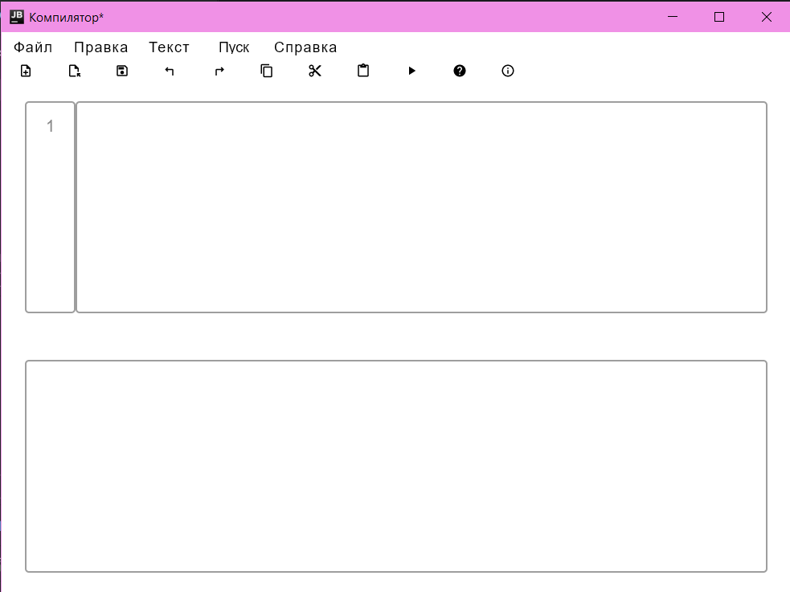
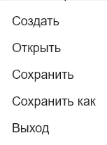
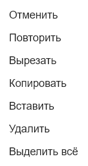
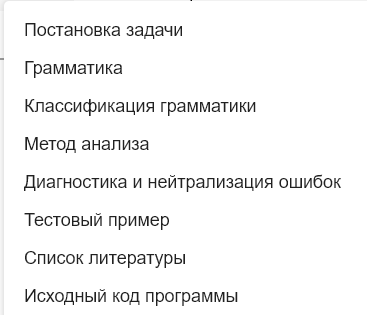
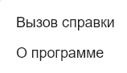
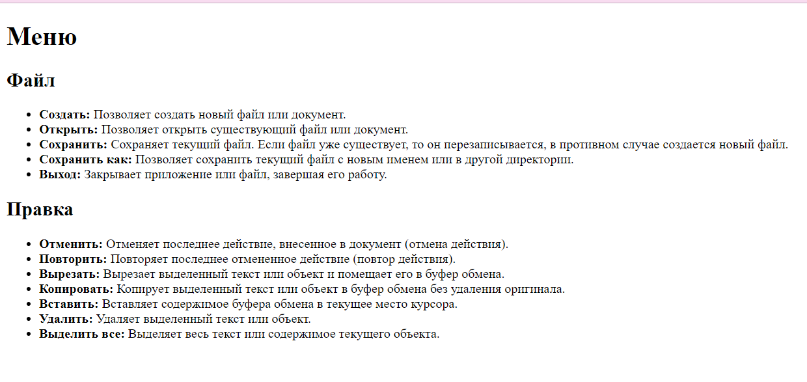
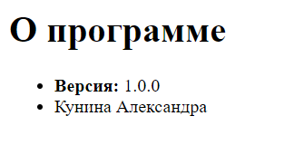

# Компилятор

Разработка текстового редактора с функциями языкового процессора.

## Лабораторная работа №1: Разработка пользовательского интерфейса (GUI) для языкового процессора
**Тема:** разработка текстового редактора с возможностью дальнейшего расширения функционала до языкового процессора.

**Цель работы:** разработать приложение с графическим интерфейсом пользователя, способное редактировать текстовые данные. Это приложение будет базой для будущего расширения функционала в виде языкового процессора.

**Язык реализации:** C#, WPF.

### Интерфейс текстового редактора



#### Получившийся текстовый редактор имеет следующие элементы:
1. Заголовок окна.

   Содержит информацию о названии открытого файла, полного пути к нему, а также о том, сохранен ли он на текущий момент (наличие символа звездочки справа от названия означает наличие несохраненных изменений).
3. Меню
   | Пункт меню | Подпункты |
   | ------ | ------ |
   | Файл |  |
   | Правка |  |
   | Текст |  |
   | Пуск | — |
   | Справка |  |
4. Панель инструментов

   

    - Создать
    - Открыть
    - Сохранить
    - Изменить размер текста
    - Отменить
    - Повторить
    - Копировать
    - Вырезать
    - Вставить
    - Пуск
    - Вызов справки
    - О программе
5. Область редактирования

   Поддерживаются следующие функции:
    - Изменение размера текста
    - Открытие файла при перетаскивании его в окно программы
    - Базовая подсветка синтаксиса
    - Нумерация строк
7. Область отображения результатов

   В область отображения результатов выводятся сообщения и результаты работы языкового процессора.

   Поддерживаются следующие функции:
    - Изменение размера текста
    - Отображение ошибок в виде таблицы
8. Строка состояния

   В дополнении к информации, выводимой в заголовке окна, показываются текушие номера строки и столбца, где находится курсор.

### Справочная система

Разделы справочной системы открываются как HTML-документы в браузере.

| Раздел | Изображение                                                                    |
| ------ |--------------------------------------------------------------------------------|
| Вызов справки |  |
| О программе |      |

## Лабораторная работа №2: Разработка лексического анализатора (сканера)

**Тема:** разработка лексического анализатора (сканера).

**Цель работы:** изучить назначение лексического анализатора. Спроектировать алгоритм и выполнить программную реализацию сканера.

| №  | Тема | Пример верной строки                                      | Справка |
|----| ----- |-----------------------------------------------------------| ------ |
| 46 | Создание функции языка Kotlin | fun sum(a: Int, b: Int): Int { <br/> return a + b <br/> } | [ссылка](https://www.geeksforgeeks.org/kotlin-functions/) |

**В соответствии с вариантом задания необходимо:**

1. Спроектировать диаграмму состояний сканера.
2. Разработать лексический анализатор, позволяющий выделить в тексте лексемы, иные символы считать недопустимыми (выводить ошибку).
3. Встроить сканер в ранее разработанный интерфейс текстового редактора. Учесть, что текст для разбора может состоять из множества строк.

**Входные данные:** строка (текст программного кода).

**Выходные данные:** последовательность условных кодов, описывающих структуру разбираемого текста с указанием места положения и типа.

### Примеры допустимых строк

```kotlin
fun sum(a: Int, b: Int): Int {
   return a + b
}
```

```kotlin
fun sum(a: Double, b: Double): Double {
   return a + b
}
```

```kotlin
fun mult(a: Double, b: Double): Double {
   return a * b
}
```

```kotlin
fun sum(P: Double, C: Double): Double {
   return P + C
}
```


### Диаграмма состояний сканера


### Тестовые примеры

1. **Тест №1.** Пример, показывающий все возможные лексемы, которые могут быть найдены лексическим анализатором.

   
2. **Тест №2.** Сложный пример.

   


## Лабораторная работа №3: Разработка синтаксического анализатора (парсера)

**Тема:** разработка синтаксического анализатора (парсера).

**Цель работы:** изучить назначение синтаксического анализатора, спроектировать алгоритм и выполнить программную реализацию парсера.

| №  | Тема | Пример верной строки | Справка |
|----| ------ | ------ | ------ |
| 46 | Создание функции языка Kotlin | fun sum(a: Int, b: Int): Int { <br/> return a + b <br/> } | [ссылка](https://www.geeksforgeeks.org/kotlin-functions/) |

[Примеры допустимых строк](#примеры-допустимых-строк)

**В соответствии с вариантом задания на курсовую работу необходимо:**
1. Разработать автоматную грамматику.
2. Спроектировать граф конечного автомата (перейти от автоматной грамматики к конечному автомату).
3. Выполнить программную реализацию алгоритма работы конечного автомата.
4. Встроить разработанную программу в интерфейс текстового редактора, созданного на первой лабораторной работе.

### Грамматика

G:

V<sub>T</sub> = { ‘ fun’ ‘return’ ‘Int’ ‘Double’ ‘Long’ ‘Float’ ‘a’…’z’  ‘A’…’Z’ ‘0’…’9’ ‘(‘ ‘ ‘ ‘:’ ‘,’ ‘)’ ‘{‘ ‘_’ ‘+’  ‘-‘  ‘*’  ‘/’  ‘}’ }

V<sub>N</sub> = {DEF, SPACE, NAME,  OPENARG, ARGUMENT, TYPEARG , COMMA ,COLON, TYPEFUN,  OPENFUNC, RETURN, EXPR, ARG1, SIGN , ARG2, END,  Б, Ц }

P = {
1. DEF → ‘fun’ SPACE
2. SPACE → ‘ ‘ NAME
3. NAME →  Б { Б | Ц | ‘_’ }  ‘(‘ OPENARG
4. OPENARG → ARGUMENT
5. ARGUMENT →  Б { Б | Ц | ‘_’ } ‘:’ TYPEARG
6. TYPEARG →  ‘Int’ | ‘Double’ | ‘Long’ | ‘Float’ COMMA | COLON
7. COMMA  →  ‘,’ OPENARG
8. COLON →  ‘)’ ‘:’ TYPEFUN
9. TYPEFUN → ‘Int’ | ‘Double’ | ‘Long’ | ‘Float’ OPENFUNC
10. OPENFUNC → ‘{‘ RETURN
11. RETURN →  ‘return’  EXPR
12. EXPR → ‘ ‘ ARG1
13. ARG1 →  Б { Б | Ц | ‘_’ } SIGN
14. SIGN →  ‘+’ | ‘-‘ | ‘*’ | ‘/’ ARG2
15. ARG2 →  Б { Б | Ц | ‘_’ } END
16. END →  ‘}’
17. Б → ‘a’ | ‘b’ | … | ‘z’ | ‘A’ | ‘B’ | … | ‘Z’
18. Ц → ‘0’ | ‘1’ | … | ‘9’


}

### Классификация грамматики

Согласно классификации Хомского, грамматика G[Z] является полностью автоматной.

### Граф конечного автомата


### Тестовые примеры

1. **Тест №1.** Все выражения написаны корректно.

   
2. **Тест №2.** Пример ошибок.

   
3. **Тест №3.** Пример ошибок.

   